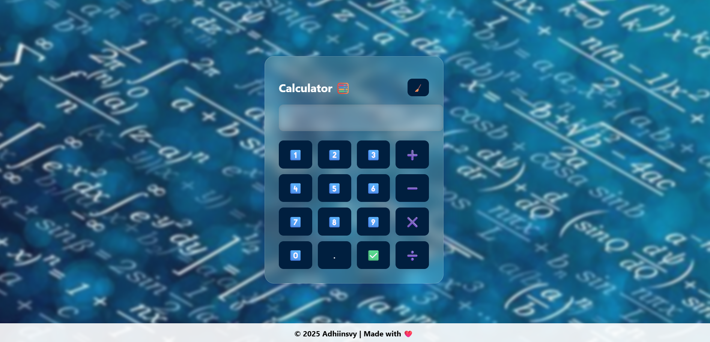

<<<<<<< HEAD
# 🧮 Calculator

A simple and user-friendly calculator built to perform basic arithmetic operations. This project was created as a part of my learning journey in programming and UI development.
## 🚀 Live Demo

Try this online: [Use it here](https://adhiinsvy13.github.io/Calculator/)
## 🚀 Features

- Addition, Subtraction, Multiplication, and Division
- Clean and intuitive UI

## 🛠️ Technologies Used

- HTML
- CSS
- JavaScript

## 📸 Preview

=======
# 🧮 Calculator App

A simple and user-friendly calculator built to perform basic arithmetic operations. This project was created as a part of my learning journey in programming and UI development.

## 🔗 **Live Demo:** [Click here to use the Calculator](https://adhiinsvy13.github.io/Calculator/)
## 🚀 Features

- Addition, Subtraction, Multiplication, and Division
- Clean and intuitive UI

## 🛠️ Technologies Used

- HTML
- CSS
- JavaScript
>>>>>>> 6b405e221d04e58b415f0e865cfd7e2f865e129a
